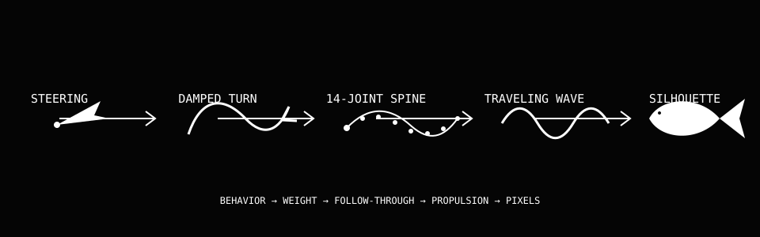
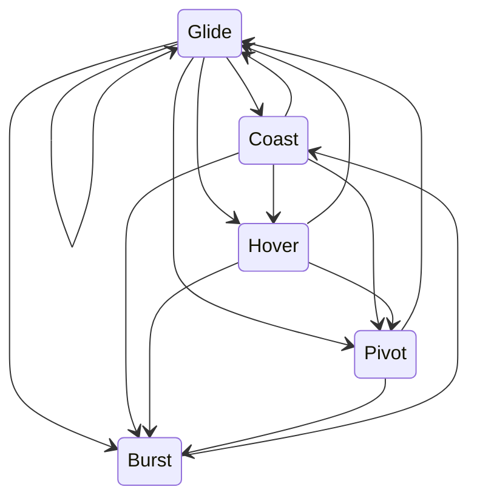

# How the procedural koi animation works

This guide explains the procedural koi animation from first principles. It also
explains the math that controls each fish.

You do not need prior knowledge of animation physics. You need basic knowledge
of C++ variables, functions, and loops.

> **Writing note:** This guide applies useful principles from ASD-STE100 and the
> Google Developer Documentation Style Guide. It does not claim certified
> ASD-STE100 compliance.



## What procedural animation means

Traditional animation stores the movement before the program starts. An artist
can draw each frame, or the artist can define key poses. The program then shows
the stored frames or moves between the key poses.

Procedural animation works differently. The program calculates each pose while
it runs. Rules, state, time, and input control the result.

This project does not store fish animation frames. It calculates these values:

- The direction that a fish wants to move.
- The speed that the fish wants to use.
- The rate at which the fish turns.
- The curve of the fish spine.
- The movement of the tail and fins.
- The body outline that the renderer draws.

The same rules produce many different poses. Each fish also has different
properties and random state changes. Thus, the school does not repeat one fixed
animation loop.

This project is a rule-based simulation. It is not a complete fluid simulation
or a biological model. The rules create believable movement at a low cost.

## The three system layers

The program separates the work into three layers.

```text
BEHAVIOR             LOCOMOTION                 RENDERING

Choose a state  ->   Update speed         ->   Build the body outline
Choose a target      Update heading            Draw fins and tail
Avoid neighbors      Update the spine           Draw at low resolution
Avoid the edge       Update the tail phase      Scale the result
```

Each layer answers one question:

1. **Behavior:** What does the fish want to do?
2. **Locomotion:** How does the body move to do it?
3. **Rendering:** Which pixels show the current body pose?

This separation is important. A renderer cannot create natural behavior by
itself. A behavior system also needs a flexible body to show a turn correctly.

## Source file map

| File | Responsibility |
| --- | --- |
| [`src/main.cpp`](../src/main.cpp) | Runs the window, fixed time step, input, and render loop. |
| [`src/config.hpp`](../src/config.hpp) | Defines shared limits and dimensions. |
| [`src/math_utils.hpp`](../src/math_utils.hpp) | Defines vector, angle, interpolation, and random functions. |
| [`src/koi.hpp`](../src/koi.hpp) | Defines the data for one fish. |
| [`src/koi.cpp`](../src/koi.cpp) | Gives each fish its initial properties. |
| [`src/school.hpp`](../src/school.hpp) | Defines the public school simulation interface. |
| [`src/school.cpp`](../src/school.cpp) | Controls behavior, steering, speed, turns, and spine constraints. |
| [`src/renderer.hpp`](../src/renderer.hpp) | Defines the public rendering interface. |
| [`src/renderer.cpp`](../src/renderer.cpp) | Converts each spine into black-and-white pixels. |

## Terms that this guide uses

| Term | Meaning in this project |
| --- | --- |
| **Vector** | A pair of numbers that gives a direction, a position, or both. |
| **Magnitude** | The length of a vector. |
| **Normalize** | Change a vector length to `1` without a change of direction. |
| **Heading** | The direction in which the fish head points, in radians. |
| **Velocity** | Movement direction multiplied by speed. |
| **State** | One named behavior, such as `Hover` or `Burst`. |
| **Node** | One point on the fish spine. |
| **Spine** | A chain of 14 nodes from the head to the tail. |
| **Phase** | The current position in a repeating tail wave. |
| **Envelope** | A value that controls wave size along the body. |
| **Time step** | The fixed amount of simulated time in one update. |
| **Interpolation** | A smooth change from one value to another value. |

Use one meaning for each term when you read the equations below.

## Coordinate system and vectors

The simulation uses a `480 x 270` coordinate system.

- The top-left point is `(0, 0)`.
- The x-coordinate increases to the right.
- The y-coordinate increases toward the bottom.
- Position and distance use pixels.
- Speed uses pixels per second.
- Angles use radians.

A two-dimensional vector has an x-part and a y-part:

$$
\mathbf{v} = (v_x, v_y)
$$

The vector magnitude is its length:

$$
\lVert\mathbf{v}\rVert = \sqrt{v_x^2 + v_y^2}
$$

The program normalizes a vector with this equation:

$$
\widehat{\mathbf{v}} =
\frac{\mathbf{v}}{\lVert\mathbf{v}\rVert}
$$

The result has a magnitude of `1`. The program can multiply this unit vector by
a weight or a speed.

The heading angle is $\theta$. The forward unit vector is:

$$
\mathbf{f}(\theta) = (\cos\theta, \sin\theta)
$$

The perpendicular function turns a vector by 90 degrees:

$$
\operatorname{perp}(x, y) = (-y, x)
$$

The renderer uses the perpendicular vector to find the left and right sides of
the fish body.

## How one frame works

The program performs these steps for each displayed frame:

1. Read the mouse and keyboard input.
2. Add real elapsed time to an accumulator.
3. Run one or more fixed simulation updates.
4. Update the behavior state of each fish.
5. Calculate a steering direction and a target speed.
6. Update the heading, speed, position, tail phase, and spine.
7. Build a body shape around the spine.
8. Draw the fish on a `480 x 270` render texture.
9. Scale the texture to the window.

The central loop has this form:

```cpp
accumulator += frameTime;

while (accumulator >= fixedStep) {
  school.Update(fixedStep, simulationTime);
  accumulator -= fixedStep;
}

DrawSchool(school, simulationTime, showDebug);
```

The program can run more than one simulation update before it draws a frame.
This action keeps the simulation time stable when a displayed frame is late.

## Fixed simulation time

The fixed time step is:

$$
\Delta t = \frac{1}{120}\text{ second}
$$

The simulation therefore targets 120 updates per second.

A fixed time step gives three benefits:

- The spine constraints get a consistent update interval.
- A fast display and a slow display produce similar movement.
- The seeded random behavior is easier to reproduce.

The program limits one measured frame interval to `0.1` second. This limit
prevents a very long pause from causing too many immediate updates.

## Each fish starts with different properties

[`Koi::Reset`](../src/koi.cpp) assigns these ranges:

| Property | Range | Effect |
| --- | ---: | --- |
| Cruise speed | `13` to `21` px/s | Sets the usual movement speed. |
| Maximum speed | `1.55` to `1.9` times cruise speed | Limits fast movement. |
| Turn strength | `4.4` to `6.8` | Changes the turn response. |
| Body length | `27` to `38` px | Changes fish size. |
| Body half-width | `17%` to `20%` of body length | Changes body shape. |
| Reactivity | `0.35` to `1.0` | Changes the response delay after a click. |
| Wave phase | `0` to $2\pi$ | Prevents synchronized tails. |

The program uses a fixed random seed. A reset gives the same initial school.
This property helps tests and visual comparisons.

## Natural behavior states

A **state machine** selects one behavior at a time. Each fish has its own state,
timer, and random number sequence.

The program uses five states:

| State | Duration | Target speed | Tail effort | Visible result |
| --- | ---: | ---: | ---: | --- |
| `Glide` | `1.7` to `5.2` s | Normal intention | `0.62` | The fish swims at a steady rate. |
| `Coast` | `0.7` to `2.1` s | `28%` of intention | `0.16` | The fish slows down with little tail motion. |
| `Hover` | `0.65` to `3.1` s | `0` | `0.05` | The fish stops and uses small fin motion. |
| `Burst` | `0.32` to `0.92` s | `108%` of maximum speed | `1.22` | The fish makes a short, fast movement. |
| `Pivot` | `0.3` to `0.78` s | `16%` of cruise speed | `1.0` | The fish slows down and makes a sharp turn. |

The state timer does not use the same duration for all fish. When a timer ends,
the program uses a random value to select the next state.



The transition probabilities are:

| Current state | Possible next states |
| --- | --- |
| `Glide` | Coast 25%, Hover 18%, Pivot 18%, Burst 11%, or Glide 28% |
| `Coast` | Hover 38%, Glide 34%, Pivot 18%, or Burst 10% |
| `Hover` | Pivot 34%, Burst 21%, or Glide 45% |
| `Burst` | Coast 100% |
| `Pivot` | Burst 38% or Glide 62% |

These transitions create an important sequence. A fish can stop, make a sharp
turn, and then make a short burst. Another fish can continue to glide.

## Deterministic random numbers

The program uses an `xorshift` generator. The generator changes a 32-bit integer
with three exclusive-OR and bit-shift operations.

```cpp
state ^= state << 13;
state ^= state >> 17;
state ^= state << 5;
```

The result looks random, but the same seed produces the same sequence. Each fish
has a separate behavior seed. One fish therefore does not depend on the state
transition of another fish.

The random values control variation. They do not control the position directly
on every frame. This rule prevents jitter.

## Steering combines multiple intentions

The program calculates a **steering vector** for each fish. This vector combines
several simple intentions.

For a normal state, the approximate sum is:

$$
\mathbf{s}_{raw} =
0.95\mathbf{f}
+ 0.62\mathbf{w}
+ 0.25\mathbf{c}
+ 0.42\mathbf{a}
+ 2.8\mathbf{q}
+ 4.8\mathbf{e}
+ \mathbf{t}
$$

The symbols have these meanings:

- $\mathbf{f}$ is the current forward direction.
- $\mathbf{w}$ is the wander direction.
- $\mathbf{c}$ is the cohesion direction.
- $\mathbf{a}$ is the alignment direction.
- $\mathbf{q}$ is the separation direction.
- $\mathbf{e}$ is the edge avoidance vector.
- $\mathbf{t}$ is the optional target vector.

The program normalizes the final sum:

$$
\mathbf{s} = \widehat{\mathbf{s}_{raw}}
$$

The values such as `0.25` and `2.8` are weights. A large weight gives an
intention more control over the final direction.

### Wander direction

The wander system uses two slow sine waves:

$$
W(t) =
0.7\sin(0.29t + seed)
+ 0.45\sin(0.113t + 1.73 \cdot seed)
$$

The program adds $W(t)$ to the current heading. It then converts the result to a
unit vector.

The two sine waves have different rates. Their sum changes smoothly and does
not repeat quickly. The fish therefore wanders without a new random turn on
each frame.

A fish in the `Hover` state does not use this wander change. It keeps its current
direction until the next state starts.

### Neighbor set

For fish $i$, a neighbor is any other fish within `37` pixels:

$$
N_i = \{j \mid 0 < \lVert\mathbf{p}_i - \mathbf{p}_j\rVert < 37\}
$$

The program uses the neighbor set for three rules.

### Cohesion

Cohesion turns a fish toward the average neighbor position:

$$
\mathbf{c} =
\operatorname{normalize}\left(
\frac{1}{|N_i|}\sum_{j \in N_i}\mathbf{p}_j - \mathbf{p}_i
\right)
$$

Cohesion keeps the school loosely connected.

### Alignment

Alignment turns a fish toward the neighbor movement directions:

$$
\mathbf{a} =
\operatorname{normalize}\left(
\sum_{j \in N_i}\widehat{\mathbf{v}_j}
\right)
$$

Alignment does not copy neighbor speeds. It uses only their directions.

### Separation

Separation applies only when two fish are less than `14` pixels apart. For one
neighbor at distance $d$, the contribution is:

$$
\mathbf{q}_j =
\operatorname{normalize}(\mathbf{p}_i - \mathbf{p}_j)
\left(\frac{14-d}{14}\right)
$$

The force is strongest when the distance is small. The force becomes zero at
`14` pixels. The program adds all close-neighbor contributions.

### Edge avoidance

The edge margin is `32` pixels. Inside this margin, the edge force increases as
the fish gets closer to the screen edge.

For example, the left-edge x-force is:

$$
e_x = \frac{32 - p_x}{32}
$$

This force is active only when $p_x < 32$. The other three edges use the same
rule with the applicable direction.

### Click target

When you click, the program stores the click position as a target for `7.5`
seconds.

Each fish gets a different response delay:

$$
delay = U(0.04, 1.15) \cdot (1.22 - reactivity)
$$

$U(a,b)$ means a random value from $a$ to $b$. A high reactivity value gives a
shorter delay.

If the fish is more than `13` pixels from the target, the target contribution
is:

$$
\mathbf{t} = 2.45 \cdot
\operatorname{normalize}(\mathbf{target} - \mathbf{position})
$$

If the fish is close to the target, the program adds a perpendicular force. It
also adds a small outward force. These forces make the fish move around the
target instead of stacking at one point.

A fish in the `Hover` state does not react until it leaves that state. This rule
creates visible hesitation.

### Worked steering example

Assume that a fish is at `(100, 100)`. Assume that the target is at `(130, 140)`.

The vector to the target is:

$$
(130,140) - (100,100) = (30,40)
$$

Its magnitude is:

$$
\sqrt{30^2 + 40^2} = 50
$$

The normalized vector is:

$$
(30,40) / 50 = (0.6,0.8)
$$

The weighted target contribution is:

$$
2.45(0.6,0.8) = (1.47,1.96)
$$

The program adds this vector to the other steering vectors. It does not point
the fish at the target immediately.

## Target speed

The program first calculates an intended speed. If no active target exists, the
intended speed is the cruise speed.

For an active target, the urgency value is:

$$
u = \operatorname{clamp}\left(\frac{distance}{105}, 0.2, 1.0\right)
$$

The intended speed is:

$$
v_{intention} = v_{cruise} +
(v_{max} - v_{cruise})u
$$

A distant fish moves faster. A nearby fish keeps at least `20%` target urgency.
The current behavior state then modifies this intention.

## The fish does not turn immediately

The steering vector gives the desired heading:

$$
\theta_{desired} = \operatorname{atan2}(s_y, s_x)
$$

Angles wrap at $-\pi$ and $\pi$. A direct subtraction can select the long turn
around the circle. The program uses this wrapped error:

$$
error = \operatorname{atan2}(
\sin(\theta_{desired}-\theta),
\cos(\theta_{desired}-\theta)
)
$$

The angular acceleration uses a damped spring:

$$
\alpha = error \cdot turnStrength \cdot multiplier
- \omega \cdot damping
$$

$\omega$ is the current angular velocity. The damping term resists the current
turn. This resistance prevents an instant heading change.

The program then updates the turn:

$$
\omega \leftarrow \omega + \alpha\Delta t
$$

$$
\theta \leftarrow \theta + \omega\Delta t
$$

| Mode | Turn multiplier | Damping | Maximum turn rate |
| --- | ---: | ---: | ---: |
| Normal | `1.0` | `3.8` | `2.25` rad/s |
| Pivot | `2.65` | `2.15` | `4.35` rad/s |

The pivot has more turn force and less damping. It also has a low target speed.
This combination creates a sharp, low-speed turn.

## Speed changes smoothly

The program does not assign the target speed directly. It uses exponential
interpolation:

$$
v \leftarrow v + (v_{target}-v)
\left(1-e^{-\lambda\Delta t}\right)
$$

$\lambda$ is the response rate. A large value gives a fast speed change.

| State | Speed response $\lambda$ |
| --- | ---: |
| Glide | `1.65` |
| Coast | `1.05` |
| Hover | `3.6` |
| Burst | `6.4` |
| Pivot | `4.2` |

This equation gives a smooth result at different update rates. It does not make
one fixed change per frame.

For example, assume that a fish enters `Hover` at `20` px/s. After one second,
its approximate speed is:

$$
20e^{-3.6} \approx 0.55\text{ px/s}
$$

The fish slows quickly, but it does not stop in one frame.

The position update is:

$$
\mathbf{velocity} = \mathbf{f}(\theta)v
$$

$$
\mathbf{position} \leftarrow
\mathbf{position} + \mathbf{velocity}\Delta t
$$

## Tail effort and tail phase

The tail effort also uses exponential interpolation. Its response rate is
`4.5`. The behavior state supplies the target effort from the state table.

The tail phase rate is:

$$
phaseRate = 0.45
+ 4.6\left(\frac{speed}{maximumSpeed}\right)
+ 0.9 \cdot tailEffort
$$

The phase update is:

$$
phase \leftarrow phase + phaseRate\Delta t
$$

The rate increases during fast movement. The rate decreases when the fish slows
down. The tail can also work hard during a low-speed pivot.

## The 14-node spine

The first spine node is the head. The last node is the tail base.

The desired distance between adjacent nodes is:

$$
spacing = \frac{bodyLength}{13}
$$

For a body length of `32` pixels, the spacing is approximately `2.46` pixels.

After the head moves, the program processes each later node. For node $i$, it
calculates the direction from node $i-1$ to node $i$:

$$
\mathbf{d}_i =
\operatorname{normalize}(\mathbf{p}_i - \mathbf{p}_{i-1})
$$

It then calculates a constrained position:

$$
\mathbf{p}_{constrained} =
\mathbf{p}_{i-1} + \mathbf{d}_i \cdot spacing
$$

The node moves toward this constrained position:

$$
\mathbf{p}_i \leftarrow
\operatorname{lerp}(\mathbf{p}_i,
\mathbf{p}_{constrained}, stiffness_i)
$$

The stiffness decreases toward the tail:

$$
stiffness_i = 0.94 - 0.17\left(\frac{i}{13}\right)
$$

The head region follows quickly. The tail region follows more slowly. This
difference produces follow-through during a turn.

## The traveling body wave

The constraint chain gives the main body curve. The renderer adds a second curve
for muscle motion.

For node $i$, the normalized body position is:

$$
r = \frac{i}{13}
$$

The wave envelope is:

$$
envelope = r^{1.72}
$$

The value is small near the head and large near the tail. The head therefore
stays stable while the tail moves from side to side.

The lateral wave is:

$$
wave =
\sin(phase - 6.1r)
\cdot bodyWidth
\cdot 1.15
\cdot r^{1.72}
\cdot (0.08 + 0.92 \cdot tailEffort)
$$

The renderer finds the local spine direction. It then gets the perpendicular
direction $\mathbf{n}$. The displayed node is:

$$
\mathbf{p}_{display} = \mathbf{p}_{spine} + \mathbf{n} \cdot wave
$$

The term $phase - 6.1r$ shifts the sine wave along the body. As the phase grows,
the curve appears to travel from the head region toward the tail.

## Body shape and fins

The renderer calculates a half-width for each spine node.

Near the head, where $r < 0.18$:

$$
profile = 0.73 + \frac{r}{0.18} \cdot 0.27
$$

After the shoulder:

$$
profile =
\left(1 - \frac{r-0.18}{0.82}\right)^{0.72}
$$

The final half-width is at least `0.7` pixel:

$$
halfWidth = \max(0.7, bodyWidth \cdot profile)
$$

For each node, the renderer calculates two points:

$$
\mathbf{left}_i = \mathbf{p}_i + \mathbf{n}_i \cdot halfWidth_i
$$

$$
\mathbf{right}_i = \mathbf{p}_i - \mathbf{n}_i \cdot halfWidth_i
$$

Triangles connect the left and right points. These triangles form the body.

The renderer then adds these parts:

- A broad nose cap.
- Two pectoral fins near the front of the body.
- Two smaller pelvic fins near the rear of the body.
- A caudal fin at the end of the spine.

The pectoral fins move more during `Hover` and `Pivot`. This motion suggests
balance and low-speed control.

The renderer first draws a white silhouette. It then draws a smaller black body
inside it. The black inset is `1.65` pixels. The result is a white contour on a
black body.

## Pixel rendering

The program draws to a `480 x 270` render texture. It uses only `BLACK` and
`WHITE` for the fish scene.

The program scales this texture to the window with nearest-neighbor filtering.
Nearest-neighbor filtering copies complete source pixels. It does not blur the
edges between source pixels.

The program keeps the `16:9` aspect ratio. It adds black space when the window
has a different aspect ratio.

Window size does not change the simulation coordinates. A fish at `(240, 135)`
stays at the logical center of the scene.

## Why the implementation is fast

The program uses these limits and data structures:

- A maximum of 48 fish.
- A fixed array for fish.
- A fixed array for ripples.
- A 14-node array for each spine.
- No heap allocation in the update or draw loop.
- A small `480 x 270` render target.

The neighbor search compares each fish with every other fish. Its complexity is
$O(n^2)$. At the maximum count, one update performs no more than `48 x 47 =
2256` ordered neighbor checks.

This cost is small for 48 fish. If you increase the count to hundreds of fish,
use a spatial grid or a spatial hash. That structure can limit each search to
nearby cells.

Rendering complexity is proportional to the fish count and the spine-node
count. The renderer draws a fixed number of triangles for each fish.

## Input behavior

| Input | Program action |
| --- | --- |
| Left click | Set a target and give each fish a separate response delay. |
| Space | Give each fish a heading change, maximum speed, and the `Burst` state. |
| `[` or `]` | Decrease or increase the active fish count. |
| `D` | Draw the calculated spine nodes. |
| `H` | Hide or show the text interface. |
| `R` | Reset the deterministic school. |
| `F11` | Change between windowed and full-screen modes. |

## Parameters that you can change

Change one group at a time. Build and run the program after each change.

| Goal | File | Values to inspect |
| --- | --- | --- |
| Change the logical resolution | [`config.hpp`](../src/config.hpp) | `kCanvasWidth`, `kCanvasHeight` |
| Change the default or maximum fish count | [`config.hpp`](../src/config.hpp) | `kInitialFish`, `kMaxFish` |
| Change fish size and personality | [`koi.cpp`](../src/koi.cpp) | `bodyLength`, `bodyWidth`, `cruiseSpeed`, `turnStrength` |
| Change state duration or transition chance | [`school.cpp`](../src/school.cpp) | `EnterState`, `UpdateNaturalState` |
| Change school spacing | [`school.cpp`](../src/school.cpp) | `37.0F`, `14.0F`, steering weights |
| Change turn sharpness | [`school.cpp`](../src/school.cpp) | `turnMultiplier`, `angularDamping`, `maximumTurnRate` |
| Change the tail wave | [`renderer.cpp`](../src/renderer.cpp) | `1.72F`, `6.1F`, `1.15F` |
| Change the body shape | [`renderer.cpp`](../src/renderer.cpp) | `WidthAt` |
| Change fin shape | [`renderer.cpp`](../src/renderer.cpp) | Pectoral and pelvic fin points |

## Summary

The program does not move a rigid fish image. It builds a new fish pose on each
frame.

The behavior state selects an intention. Steering combines the intention with
neighbor and boundary rules. A damped turn changes the heading. Smooth speed
control changes the position. A constrained spine follows the head. A traveling
wave moves the tail. The renderer builds a pixel outline around the final spine.

These small systems work together. Their combination makes the fish look alive.

## Writing references

- [ASD-STE100 overview](https://www.asd-ste100.org/about_STE.html)
- [ASD-STE100 Issue 9](https://www.asd-ste100.org/assets/files/ASD-STE100_ISSUE9.pdf)
- [Google developer documentation style highlights](https://developers.google.com/style/highlights)
- [Google guidance for active voice](https://developers.google.com/style/voice)
- [Google guidance for present tense](https://developers.google.com/style/tense)
